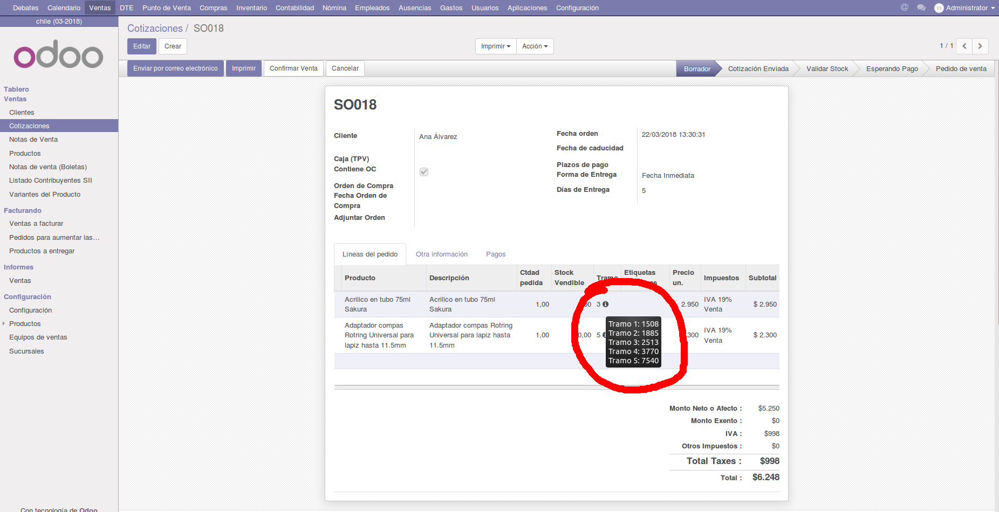

Dynamic Tooltip MFH
===================

Este módulo permite utilizar un widget de tooltip para campos de cadena simples,
donde se requiera mostrar información adicional con solo pasar el mouse por
encima del mismo. La información a mostrar se tomará de otro campo dentro del
XML de la vista, preferiblemente invisible.

Uso
---

Para poder utilizar el widget, lo primero que debemos hacer es declarar un campo
de tipo ``fields.Char`` dentro del modelo que queramos que aparezca el widget, y
se debe llamar ``tooltip_helper``. Éste campo deberá ser calculado dinámicamente
(sino, no tiene gracia que sea un widget dinámico), donde el resultado que
queramos mostrar se calcule automáticamente y se guarde en ese campo.

```py
tooltip_helper = fields.Char(compute='_compute_tooltip_helper')

@api.multi
@api.depends('some_field')  # Campo del que dependerá el tooltip
def _compute_tooltip_helper(self):
    for record in self:
        # Guardamos en la variable lo que queramos mostrar, para este ejemplo
        # guardamos el valor any_description del campo some_field
        record.tooltip_helper = record.some_field.any_description

```

Luego podremos modificar la vista en el XML para agregar el widget ``dynamic_tooltip`` al campo en cuestión. Es importante que agreguemos a la
vista el campo ``tooltip_helper`` para que nuestro widget pueda sacar la
información del mismo.

```xml
    <field name="tooltip_helper" invisible="1">
    <field name="some_field" widget="dynamic_tooltip" />
```


